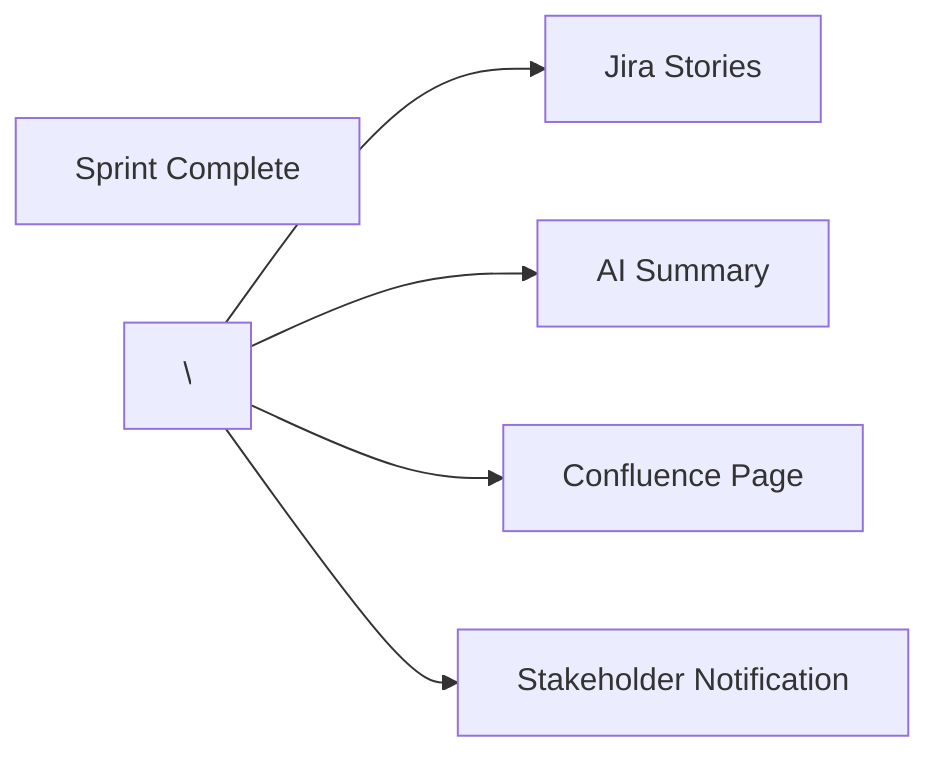

\# Release Notes Automation using Jira + Confluence + AI

\## Problem

At the end of every sprint, release notes were manually created by reviewing completed Jira stories.

Challenges:

\- Time-consuming process

\- Missing updates

\- Inconsistent format

\- Delayed communication

\---

\## Goal

Automate release note generation and publishing process.

\---

\## Proposed Solution

1\. Sprint closes in Jira

2\. Completed stories identified automatically

3\. AI generates release note summary

4\. Content published to Confluence

5\. Stakeholders notified automatically

\---

\## Workflow

\## Product Owner Responsibilities

\- Requirement gathering

\- Stakeholder alignment

\- User story creation

\- Acceptance criteria definition

\- Sprint planning

\- Release validation

\---

\## Success Metrics

| Metric | Before | After |

|----------|---------|---------|

| Release Notes Creation | 2 Hours | 10 Minutes |

| Manual Effort | High | Low |

| Documentation Quality | Variable | Consistent |

\---

\## Business Impact

\- Faster stakeholder communication

\- Reduced manual effort

\- Improved release visibility

\- Standardized documentation

